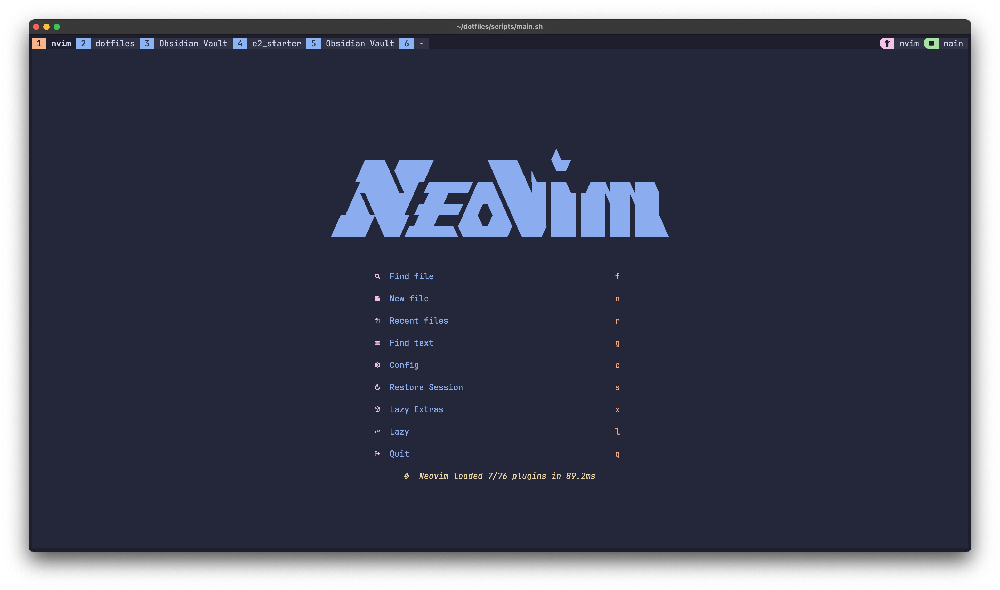
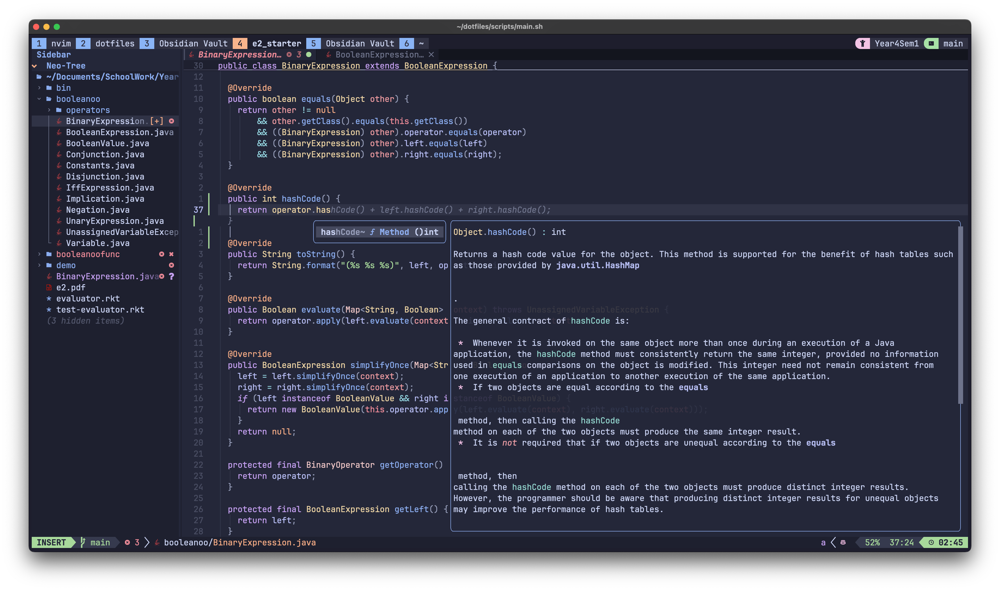
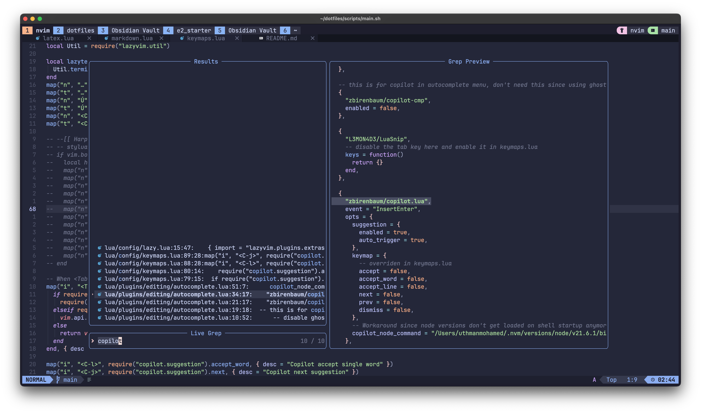

# My NeoVim Configuration

This set of configuration was taken from [LazyVim](https://github.com/LazyVim/LazyVim) and modified to my liking.







## Installation

- Install nvim. On macOS, you can use Homebrew:
```bash
brew install neovim
```
- Clone this repository to `~/.config/nvim`:
```bash
git clone https://github.com/uthmanmoh/nvim ~/.config/nvim
```

- Setup a [Nerd Font](https://www.nerdfonts.com/). I use JetBrainsMono Nerd Font. You can install it using
```bash
brew install font-jetbrains-mono-nerd-font
```
- Make sure you set the font in your terminal emulator to the Nerd Font you installed, and restart the terminal.

- Install these required tools:
```bash
brew install ripgrep fzf fd
```

- Start neovim:
```bash
nvim
```
